# 프로젝트 생성

Spring Boot 프로젝트를 생성하는 방법은 여러가지가 있습니다.  

* [Glue Maven Project 생성하기](./create-project.html#glue_maven_project)
* [archetype에서 Project 생성하기](./create-project.html#archetype)
* [Spring Initializr 에서 Project 생성하기](./create-project.html#spring_initialzr)

> 온라인 문서상의 예제는 
> * Glue Maven Project 유형과, 
> * Spring Initializr 유형으로 생성된 Project에서 시작합니다. 
> 
> GitHub의 [glue-maven-project](https://github.com/poscoict-glueframework/glue-examples/tree/master/glue-maven-project) 와 
> [quick-start](https://github.com/poscoict-glueframework/glue-examples/tree/master/quick-start) 를 참고하세요. 

## <a name="glue_maven_project"></a>Glue Maven Project 생성하기

GluePlugin이 설치된 Eclipse에서 프로젝트를 생성합니다. ( Spring Tool Suite 가능 ) 

프로젝트는 다음과 같은 순서로 생성할 수 있습니다.

1. Eclipse 에서 File 메뉴의 New -> Project 를 실행합니다.([그림](../images/eclipse_menu_file_new.png))  
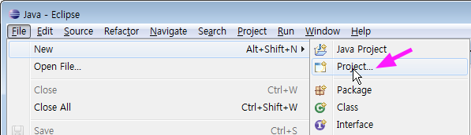

2. New Project 다이얼로그에서 Glue Maven Project를 선택하고, Next를 클릭합니다.([그림](../images/env_plugin-wizard.png))  
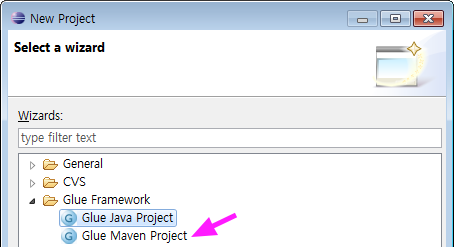

    > New Project 다이얼로그에서 Glue Framework이 보이지 않으면,   
    > [여기](./env-glue.html#GluePlugins)를 참고해서 GluePlugin을 설치하세요.

3. Project name 을  _glue-demo_ 라고 입력한 후, Finish 버튼을 클릭합니다.([그림](../images/eclipse_new_project.png))    
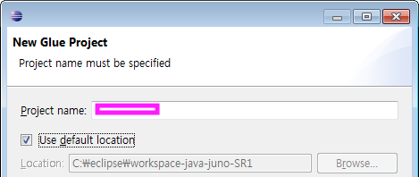

4. Package Explorer 에서  _glue-demo_ 을 확인합니다.  
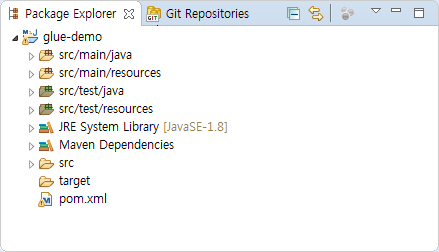

    > 생성된 Project 에서 glue-core artifact를 찾지 못하면,  
    > [여기](./env-glue.html#library)를 참고해서 Local Repository에 aritifact를 추가하세요.

5. `pom.xml` 을 확인합니다.  
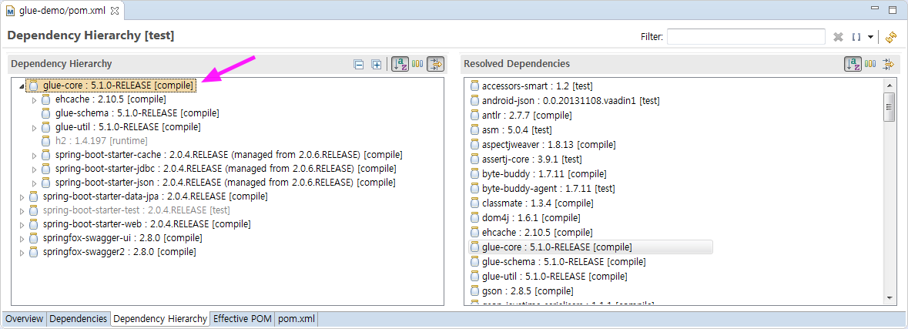

## <a name="archetype"></a>archetype 에서 Project 생성하기

IDE에서 archetype을 선택해서 프로젝트를 생성합니다. 

다음은 Eclipse에서 프로젝트를 생성하는 방법입니다.

1. Eclipse 에서 File 메뉴의 New -> Project 를 실행합니다.([그림](../images/eclipse_menu_file_new.png))  


2. New Project 다이얼로그에서 Maven Project를 선택하고, Next를 클릭합니다.  
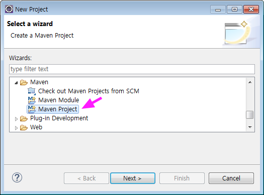

3. New Maven Project 다이얼로그에서 Next 를 클릭합니다. Create a simple project 를 체크하지 않습니다.  
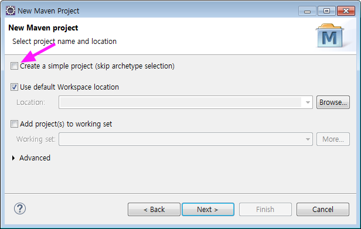

4. New Maven Project 다이얼로그에서 Filter 에 _mes3_ 을 입력합니다.  
검색된 것 중에서 _base-archetype_을 선태한 후 Next 를 클릭합니다.    
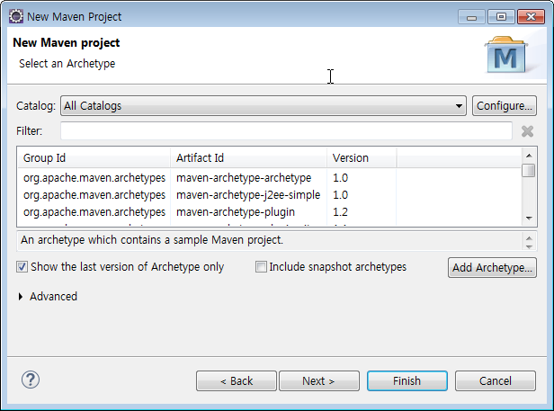

    > _mes3_ archetype이 없으면,  
    > [여기](./env-glue.html#archetype)를 참고해서 archetype을 추가하세요.  
    > 그렇지 않으면, 공개된 archetype으로 project를 생성하세요.

5. Group Id 를 입력합니다. ( 예시 : _com.posco.mes3.coldcoilcenter_ )  
Artifact Id 를 입력합니다. ( 예시 : _coldcoil-center_ )
Package 를 수정합니다. ( 예시 : _com.posco.mes3.coldcoilcenter_ )  
user Property 를 입력합니다. ( 예시 : _홍길동_ )  
입력사항을 확인한 후 Finish 버튼을 클릭합니다.  
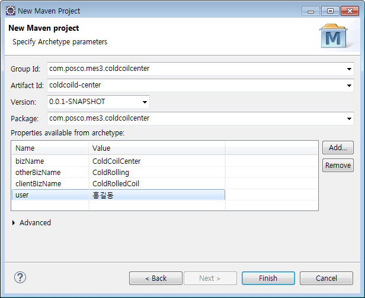
 
    > POSCO MES3향 archetype은 비공개로 2가지가 있습니다.  
    > * _base-archetype_  
    > * _cqrs-archetype_

6. Package Explorer 에서  _coldcoil-center_ 을 확인합니다.  
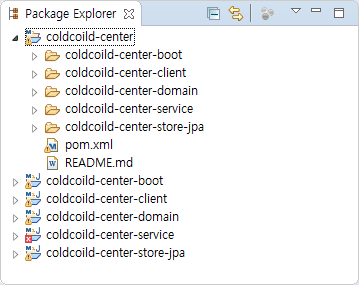


## <a name="spring_initialzr"></a>Spring Initializr 에서 생성한 Project Import하기

Spring Initializr([https://start.spring.io](https://start.spring.io))에서 프로젝트를 생성하고, 이를 IDE에서 Import 합니다.

다음은 Eclipse에서 Import 하는 방법입니다.

1. Spring Initializr 를 실행합니다.  
사이트에서 Spring Boot 프로젝트를 생성할 수 있습니다.    
Java / Kotlin / Goovy 
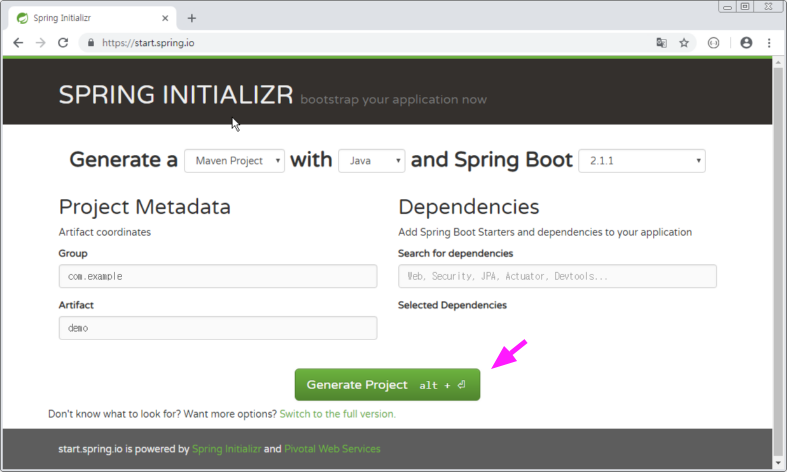

    * 빌드는 Maven을 사용하므로 Maven Project로 합니다.   
    * 언어는 Java 입니다. 
    * Spring Boot 버전은 2.0.x 입니다.  

2. Generate Project 를 클릭합니다.  
demo.zip 파일이 다운로드됩니다.

    * Project MetaData와 Dependency 입력값은 pom.xml 에서 확인하세요.  
    * Glue Maven Project의 pom.xml Web, JPA, Devtools, H2 이 있습니다.  

3. 압축을 풉니다. 다음은 GitBash 커맨드 예시입니다.

    ```bash
    $ cd ~/Downloads
    $ unzip demo.zip  -d /c/workspace/
    $ ls /c/workspace/ -l
    ```

4. Eclipse의 File 메뉴에서 Import 를 클릭합니다.  
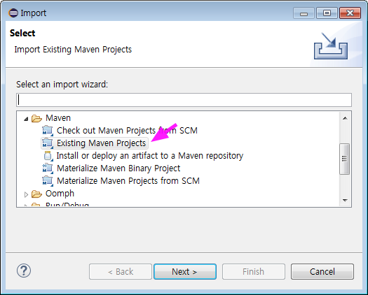

5. Root Directory를 _workspace_로 변경하고, _demo_/pom.xml 를 선택한 후, Finish 를 클릭합니다.    
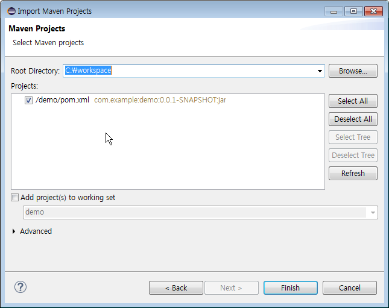

6. Package Explorer 에서  _demo_ 을 확인합니다.  
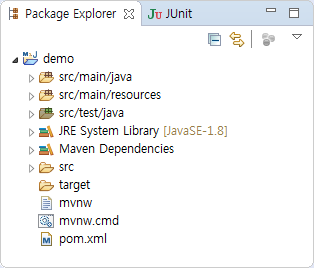

