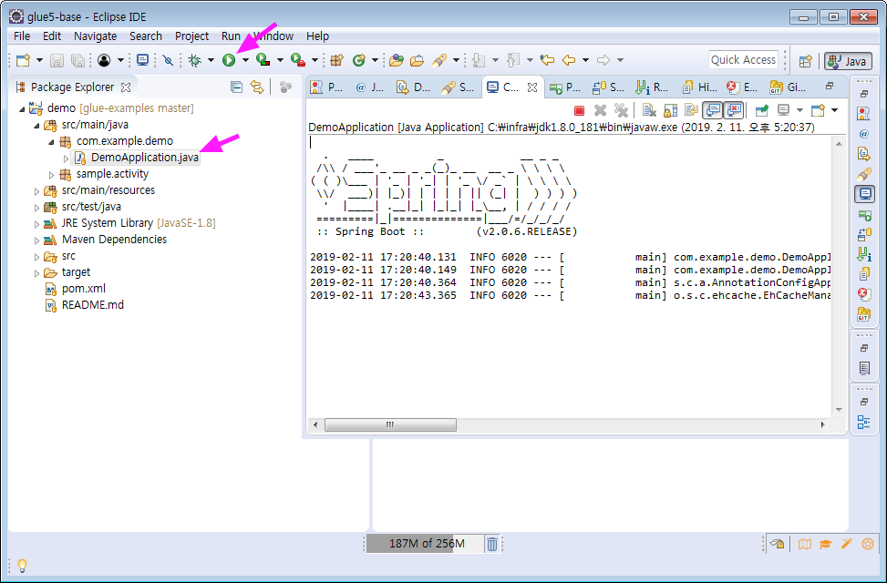

# SpringApplication 실행하기

Spring Boot 을 실행하는 방법은 여러가지가 있습니다.

* executable jar 로 패키징 된 것을 java -jar 로 실행하기
* IDE에서 실행하기
* Maven Plugin 으로 실행하기

## <a name="running_as_a_packaged_application"></a>java -jar executable_jar

Maven 빌드( **mvn package** 또는 **mvn install** )를 실행하면, pom.xml 의 **spring-boot-maven-plugin** 에 의해 repackage 가 수행됩니다.
Maven 빌드 결과는 executable jar 파일이며, *target* 폴더에 생성됩니다.  

```bash
$ # GitBash #
$ cd /c/workspace
$ git clone https://github.com/poscoict-glueframework/glue-examples.git
$ cd glue-examples/quick-start
$ 
$ mvn package                 # Maven 빌드(패키징)
$ java -jar target/demo.jar   # 실행하기
```

## <a name="running_from_ide"></a>Eclipse (Run as ...)

Eclipse IDE에서 실행하기 위해서는 해당 프로젝트가 Import 되어 있어야 합니다. 

그리고 Run 버튼을 클릭하면 됩니다.


Run 버튼을 클릭하기 전에 실행클래스( ex. DemoApplication )를 지정하지않고, 다음과 같이 프로젝트만 선택되어있으면, 
다이얼로그창에서 Java Application 유형을 선택하고, 실행클래스인 DemoApplication 을 선택하면 됩니다. ([그림](../../images/eclipse_run_button_select.png)) 

## mvn spring-boot:run

Spring Boot Maven Plugin 으로 실행하기입니다.

pom.xml 의 **spring-boot-maven-plugin** 에 의해 run 이라는 goal을 실행하는 방법입니다.  

```bash
$ # GitBash #
$ cd /c/workspace
$ git clone https://github.com/poscoict-glueframework/glue-examples.git
$ cd glue-examples/quick-start
$ 
$ mvn spring-boot:run  # 실행하기
```

## devtools

로컬 개발환경에서 소스 수정이 발생때마다 패키징후, 실행하는 과정을 거치지하고, 
빠른 재시작이 필요할 수 있습니다. 

pom.xml에 **spring-boot-devtools** 이 포함되어 있다면, 소스가 변경시마다 SpringApplication이 재시작됩니다.   

```xml
<dependency>
    <groupId>org.springframework.boot</groupId>
    <artifactId>spring-boot-devtools</artifactId>
    <optional>true</optional>
</dependency>
```

```bash
$ # GitBash #
$ cd /c/workspace
$ git clone https://github.com/poscoict-glueframework/glue-examples.git
$ cd glue-examples/glue-maven-project
$ 
$ mvn spring-boot:run  # 실행하기
$ 
$ # mvn spring-boot:run 을 실행하면, 다음과 같은 로그를 확인할 수 있습니다. 
$ # Tomcat started on port(s): 8080 (http) with context path ''
$ # Started SampleApplication in 30.09 seconds (JVM running for 32.088)
$ 
$ # Eclipse에서 소스 수정하면, 재시작 로그를 확인할 수 있습니다. 
```

## Ref. 참고

* [https://spring.io/projects/spring-boot](https://spring.io/projects/spring-boot)
* [https://start.spring.io/](https://start.spring.io/)
* [https://docs.spring.io/spring-boot/docs/2.0.6.RELEASE/api/](https://docs.spring.io/spring-boot/docs/2.0.6.RELEASE/api/)
* [https://docs.spring.io/spring-boot/docs/2.0.6.RELEASE/reference/html/](https://docs.spring.io/spring-boot/docs/2.0.6.RELEASE/reference/html/)
* [https://docs.spring.io/spring-boot/docs/2.0.6.RELEASE/reference/htmlsingle/](https://docs.spring.io/spring-boot/docs/2.0.6.RELEASE/reference/htmlsingle/)
* [https://docs.spring.io/spring-boot/docs/2.0.6.RELEASE/maven-plugin/](https://docs.spring.io/spring-boot/docs/2.0.6.RELEASE/maven-plugin/)