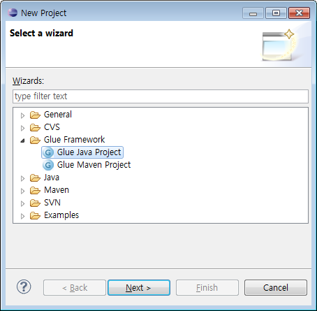
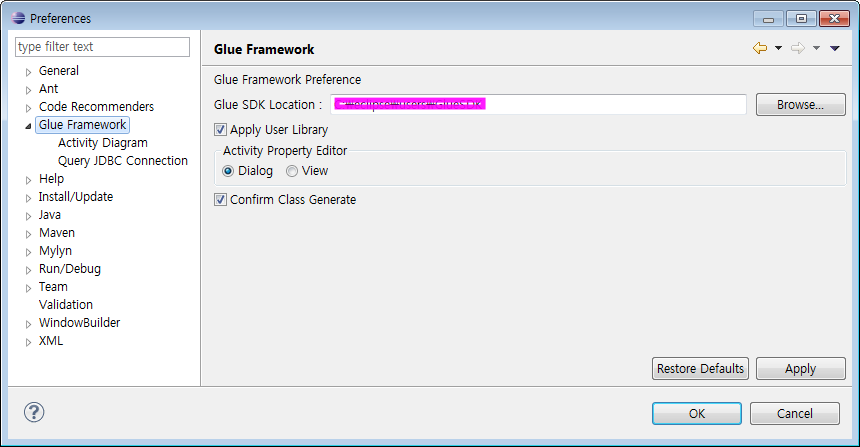
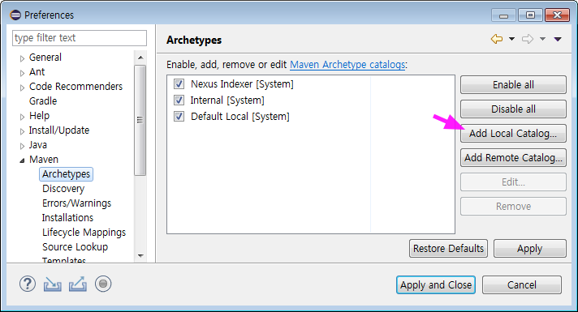

# 개발환경

이번 장의 내용을 응용해서 프로젝트에 맞는 개발 환경 구성할 수 있습니다.  
윈도우 환경이라고 가정하며, Eclipse 에서 GlueSDK를 사용할 수 있도록 개발환경을 구성합니다.  

* Glue Plugins
* GlueSDK
* Local Repository

주요 디렉토리 구조는 다음과 같다고 가정합니다.

> /infra/jdk1.8.0_192  
> /infra/apache-maven-3.5.4  
> /infra/GlueSDK  
> /ide/eclipse  
> /workspace  

## <a name="GluePlugins"></a>GluePlugin 설치

GluePlugin은 Eclipse의 dropins 폴더에 복사하면, Eclipse 실행시에 로딩됩니다.

1. 다운로드  
아래 사이트에 로그인 후 GluePlugin을 다운로드합니다(게스트로그인 >> 교육용패키지 >> 기타파일).  
교육용패키지로 이동해서 기타파일에서 GluePlugin을 찾아서 다운로드합니다.

    * [https://www.solutionpot.co.kr](https://www.solutionpot.co.kr)

2. 설치(압축풀기)  
Eclipse가 실행중 일 경우, Eclipse를 종료한 후 압축을 풉니다.  
Eclipse는 *`C:\ide\eclipse`* 에 설치했다고 가정합니다.
```bash
$ cd ~/Downloads
$ unzip eclipse_plugins\(2.0.4\).zip  -d /c/ide/eclipse/dropins
$ ls /c/ide/eclipse/dropins -l
```
    
3. 확인(Eclipse)  
Eclipse를 실행해서, 메뉴 >> File >> New >> Project 를 실행합니다.  
Wizard창에서 Glue Framework 을 확인할 수 있습니다.  



## <a name="GlueSDK"></a>GlueSDK

GlueSDK는 Eclipse의 workspace별로 지정합니다.  

1. 다운로드

    * [https://www.solutionpot.co.kr](https://www.solutionpot.co.kr)

2. 설치(압축풀기)
```bash
$ cd ~/Downloads
$ unzip GlueSDK-5.1.0-RELEASE.zip  -d /c/infra
$ ls /c/infra/GlueSDK -l
```

3. GlueSDK Location 설정  


4. Eclipse 재시작  
Glue Activity Diagram 과 관련된 설정은 Eclipse 재시작을 필요로 합니다.   
Eclipse 실행시, GluePlugin이 로딩되면서, GlueSDK/config/glue-config.xml를 확인합니다. 

## <a name="m2"></a>Local Repository 구성

Glue Framework 은 Maven Central Repository에 등록되어 있지 않기 때문에 Local Repository 에 직접 추가합니다.

### <a name="library"></a>glue-framework library

Eclipse에서 Glue Maven Project 유형의 Project를 생성하면, pom.xml 에 다음과 같은 dependency를 확인할 수 있습니다.

```xml
<dependency>
    <groupId>com.poscoict.glueframework</groupId>
    <artifactId>glue-core</artifactId>
    <version>5.1.0-RELEASE</verion>
</dependency>
```

다음 순서로 Local Repository에 artifact 들을 추가합니다.

1. GlueSDK 의 repo 디렉토리로 이동
```bash
$ cd /c/infra/GlueSDK/repo
$ ls -l
```

2. mvn install:install-file 커맨드 수행  
순서대로 4개를 실행합니다.
```bash
$ mvn install:install-file -Dfile=glue-framework-5.1.0-RELEASE.pom -DpomFile=glue-framework-5.1.0-RELEASE.pom
$ mvn install:install-file -Dfile=glue-schema-5.1.0-RELEASE.jar -DpomFile=glue-schema-5.1.0-RELEASE.pom
$ mvn install:install-file -Dfile=glue-util-5.1.0-RELEASE.jar -DpomFile=glue-util-5.1.0-RELEASE.pom
$ mvn install:install-file -Dfile=glue-core-5.1.0-RELEASE.jar -DpomFile=glue-core-5.1.0-RELEASE.pom    
```

3. glue-ucube, glue-push는 dependecy를 충족시킨후에 커맨드 수행(생략)
```bash
$ mvn install:install-file -Dfile=glue-ucube-5.1.0-RELEASE.jar -DpomFile=glue-ucube-5.1.0-RELEASE.pom    
$ mvn install:install-file -Dfile=glue-push-5.1.0-RELEASE.jar -DpomFile=glue-push-5.1.0-RELEASE.pom    
```

### <a name="archetype"></a>archetype 

Eclipse에서 Maven Project 생성시 Create a simple project([그림](../images/eclipse_default_maven_wizard_step1.png))를 체크하지 않으면 archetype 를 선택해서 프로젝트를 생성할 수 있습니다.  

1. archetype 확보
    * base-archetype-0.0.2.jar
    * cqrs-archetype-0.0.2.jar

2. mvn install:install-file 커맨드 수행
```bash
$ mvn install:install-file -Dfile=archetype-parent-0.0.2.pom -DpomFile=archetype-parent-0.0.2.pom -Dpackageing=pom
$ mvn install:install-file -Dfile=base-archetype-0.0.2.jar -DpomFile=base-archetype-0.0.2.pom -Dpackaging=jar    
$ mvn install:install-file -Dfile=cqrs-archetype-0.0.2.jar -DpomFile=cqrs-archetype-0.0.2.pom -Dpackaging=jar    
```

3. mvn archetype:update-local-catalog 커맨드 수행
```bash
$ mvn -f base-archetype-0.0.2.pom archetype:update-local-catalog    
$ mvn -f cqrs-archetype-0.0.2.pom archetype:update-local-catalog
```

4. archetype-catalog.xml 파일확인  
.m2 (사용자홈디렉토리 밑에 있음)
```bash
$ ls /c/Users/Administrator/.m2/ -l
```

5. Eclipse에서 Local Catalog 추가  
메뉴 >> Window >> Preferences >> Maven >> Archetypes  


## Ref. 참고

* [Glue Downloads](https://www.solutionpot.co.kr)
* [Glue Plugins Documentation](https://www.solutionpot.co.kr/doc/plugins/index.html)
* [Maven `install-file` Guide](https://maven.apache.org/guides/mini/guide-3rd-party-jars-local.html)
* [What is Archetype?](https://maven.apache.org/guides/introduction/introduction-to-archetypes.html)