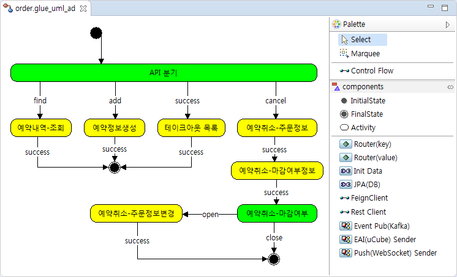
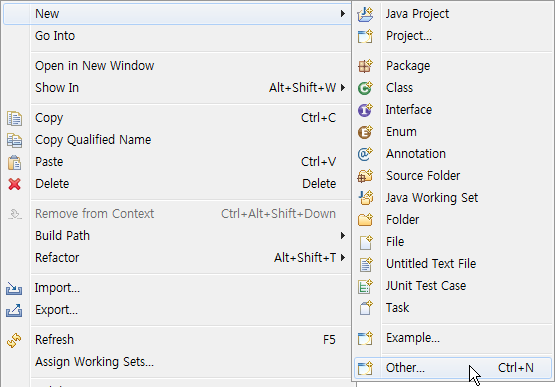
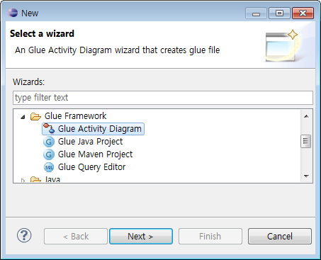
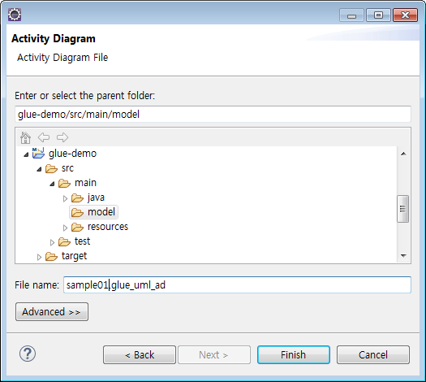
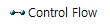
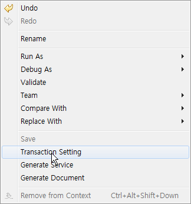
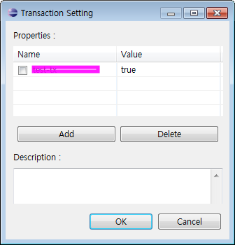
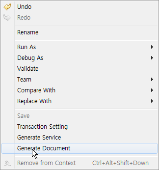
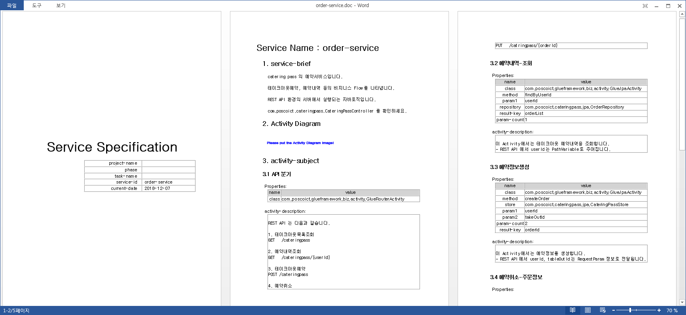

# Glue Activity Diagram

일반적으로 Activity Diagram은 객체의 상태가 아닌 처리 로직이나 조건에 따른 처리흐름을 순서에 따라 정의한 다이어그램을 의미합니다.  
Glue Activity Diagram은 이러한 Activity의 흐름을 GlueService 라는 XML 파일로 생성하는 기능까지 포함합니다.  
Glue Activity Diagram은 GluePlugin이 설치되어 있는 Eclipse에서 작성합니다. 

다음은 Glue Activity Diagram 예시입니다.  


Glue Activity Diagram 은 다음과 같이 생성합니다. 

1. 프로젝트 생성  
[여기](./create-project.html#glue_maven_project)를 참고해서, _glue-demo_ 프로젝트를 생성합니다.

1. Glue Activity Diagram 생성  
Eclipse 의 File 메뉴에서 New -> Other 를 실행합니다.  
  
New 다이얼로그에서 Glue Activity Diagram을 선택하고 Next를 클릭합니다.  
  
File 생성위치를 지정한 후, File name 을 입력하고, Finish 를 클릭합니다. File 확장자는 glue_uml_ad 입니다.    


1. Glue Activity Diagram 작성  
생성된 Glue Activity Diagram 에 선전된 대상 비지니스처리 흐름을 작성합니다.  

> [이곳](https://www.solutionpot.co.kr/doc/framework/docs/plugin_ad.html)에서 
> Palette의 [Layout 변경메뉴](https://www.solutionpot.co.kr/doc/framework/images/env_plugin-pallet.png), 
> [Outline 뷰](https://www.solutionpot.co.kr/doc/framework/images/env_plugin-outline.png), 
> [Activity 정렬](https://www.solutionpot.co.kr/doc/framework/images/env_plugin-align.png) 을 확인할 수 있습니다.

<a name="palette"></a>Palette 에는 다음과 같은 구성요성들이 있습니다. 
이를 이용해서 Glue Activity Diagram을 작성합니다. 

|구성요소       |Palette           |설명|
|-------------|--------------|---|
|Transition   ||하나의 상태에서 다른 상태로의 제어 흐름을 보여주는데 사용|
|Initial State||처리흐름이 시작되는 곳을 의미|
|Final State  ||처리흐름이 종료되는 곳을 의미|
|Activity     ||행위나 작업등 무언가를 하고 있는 상태|

Palette에는 다음과 같은 Reuse Activity 도 있습니다. 

* Router(key) : key의 유무에 의한 분기 activity
* Router(value) : value에 의한 분기 activity
* Init Data : GlueContext에 data 추가 activity. 
* JPA(DB) : Store에 Data를 CRUD하는 activity
* feign : feign clinet activity
* rest : rest client activity
* Event : Kafka로 event를 보내는 activity
* EAI : uCube로 message를 보내는 activity
* Push : WebShocket으로 message를 보내는 activity

Palette에 나타나는 Reuse Activity는 glue-config.xml 에 정의되어 있습니다.
glue-config.xml 은 GlueSDK 에 포함되어 있습니다. 

## <a name="activity"></a>Activity 설정

Glue Activity Diagram 을 통해 GlueService 라는 MetaData를 생성합니다. 
MetaData에는 Activity의 Property정보를 포함합니다. 

Activity들은 Property는 [Dialog](https://www.solutionpot.co.kr/doc/framework/images/env_plugin-dialog.png)
또는 [View](https://www.solutionpot.co.kr/doc/framework/images/env_plugin-view.png) 형태의 Editor에서 설정합니다.  

Reuse Activity는 이러한 Property를 미리 정의되어 있습니다. 
Editor에서 Property의 값을 변경하면 됩니다. 

Reuse Activity의 Property는 [Javadoc](../apidocs/)에서 확인할 수 있습니다. 

|Reuse Activity|Javadoc      |
|--------------|--------------|
|Router(key)   |[com.poscoict.glueframework.biz.activity.GlueRouterActivity](../apidocs/com/poscoict/glueframework/biz/activity/GlueRouterActivity.html)|
|Router(value) |[com.poscoict.glueframework.biz.activity.GlueRouterActivity](../apidocs/com/poscoict/glueframework/biz/activity/GlueRouterActivity.html)|
|Init Data     |[com.poscoict.glueframework.biz.activity.GlueInitParamActivity](../apidocs/com/poscoict/glueframework/biz/activity/GlueInitParamActivity.html)|
|JPA(DB)       |[com.poscoict.glueframework.biz.activity.GlueJpaActivity](../apidocs/com/poscoict/glueframework/biz/activity/GlueJpaActivity.html)|
|Rest Client   |[com.poscoict.glueframework.biz.activity.GlueRestClientActivity](../apidocs/com/poscoict/glueframework/biz/activity/GlueRestClientActivity.html)|
|...           |... |

## <a name="transaction"></a>Transaction 설정

Glue Actvivity Diagram내 팝업메뉴(마우스 오른쪽)의 Transaction Setting를 실행합니다.  


Transaction Setting 다이얼로그에서 Add 버튼을 클릭한 후 PROPAGATION 옵션을 설정할 수 있습니다.    


7가지의 PROPAGATION 설정이 가능합니다.([참고](https://docs.spring.io/spring/docs/current/javadoc-api/org/springframework/transaction/TransactionDefinition.html))

* PROPAGATION_MANDATORY
* PROPAGATION_NESTED
* PROPAGATION_NEVER
* PROPAGATION_NOT_SUPPORTED
* PROPAGATION_REQUIRED
* PROPAGATION_REQUIRES_NEW

## <a name="generate_xml"></a>GlueService(MetaData) 생성

Glue Actvivity Diagram내 팝업메뉴(마우스 오른쪽)의 Generation Service를 실행합니다.  


GlueServcie가 생성될 위치는 _glue-demo_ 프로젝트 일 경우 `src/main/resource/service` 입니다.   

Glue Activity Diagram에 작성된 모든 Activity는 유효한 class 값을 갖습니다.
필요시 java 파일생성기능이 작동합니다. 

다음은 order-service.xml ( [order.glue_uml_ad](../images/glue_activity_diagram-order.png) ) 예시입니다.

```xml
<?xml version="1.0" encoding="UTF-8"?>
<service name="order-service" initial="API 분기" xmlns="http://www.poscoict.com/glueframework/service">
    <activity name="API 분기" class="com.poscoict.glueframework.biz.activity.GlueRouterActivity">
        <transition name="add" value="예약정보생성"/>
        <transition name="cancel" value="예약취소-주문정보"/>
        <transition name="find" value="예약내역-조회"/>
        <transition name="success" value="테이크아웃 목록"/>
    </activity>
    <activity name="예약내역-조회" class="com.poscoict.glueframework.biz.activity.GlueJpaActivity">
        <transition name="success" value="end"/>
        <property name="param1" value="userId"/>
        <property name="repository" value="com.poscoict.cateringpass.jpa.OrderRepository"/>
        <property name="method" value="findByUserId"/>
        <property name="param-count" value="1"/>
        <property name="result-key" value="orderList"/>
    </activity>
    <activity name="예약정보생성" class="com.poscoict.glueframework.biz.activity.GlueJpaActivity">
        <transition name="success" value="end"/>
        <property name="param1" value="userId"/>
        <property name="param2" value="takeOutId"/>
        <property name="result-key" value="orderId"/>
        <property name="store" value="com.poscoict.cateringpass.jpa.CateringPassStore"/>
        <property name="method" value="createOrder"/>
        <property name="param-count" value="2"/>
    </activity>
    <activity name="예약취소-주문정보" class="com.poscoict.glueframework.biz.activity.GlueJpaActivity">
        <transition name="success" value="예약취소-마감여부정보"/>
        <property name="param1" value="orderId"/>
        <property name="store" value="com.poscoict.cateringpass.jpa.CateringPassStore"/>
        <property name="method" value="getTakeOutId"/>
        <property name="param-count" value="1"/>
        <property name="result-key" value="takeOutId"/>
    </activity>
    <activity name="예약취소-마감여부정보" class="com.poscoict.glueframework.biz.activity.GlueJpaActivity">
        <transition name="success" value="예약취소-마감여부"/>
        <property name="param1" value="takeOutId"/>
        <property name="store" value="com.poscoict.cateringpass.jpa.CateringPassStore"/>
        <property name="method" value="isCancelAvailable"/>
        <property name="param-count" value="1"/>
        <property name="result-key" value="isClosed"/>
    </activity>
    <activity name="예약취소-마감여부" class="com.poscoict.glueframework.biz.activity.GlueRouterActivity">
        <transition name="close" value="end"/>
        <transition name="open" value="예약취소-주문정보변경"/>
        <property name="ctx-key" value="isClosed"/>
    </activity>
    <activity name="예약취소-주문정보변경" class="com.poscoict.glueframework.biz.activity.GlueJpaActivity">
        <transition name="success" value="end"/>
        <property name="param1" value="orderId"/>
        <property name="store" value="com.poscoict.cateringpass.jpa.CateringPassStore"/>
        <property name="method" value="cancelOrder"/>
        <property name="param-count" value="1"/>
        <property name="result-key" value="isClosed"/>
    </activity>
    <activity name="테이크아웃 목록" class="com.poscoict.glueframework.biz.activity.GlueJpaActivity">
        <transition name="success" value="end"/>
        <property name="result-key" value="takeoutList"/>
        <property name="method" value="findTakeoutAll"/>
        <property name="repository" value="com.poscoict.cateringpass.jpa.CateringPassStore"/>
    </activity>
</service>
```

## <a name="generate_doc"></a>Documentation 생성

Glue Actvivity Diagram내 팝업메뉴(마우스 오른쪽)의 Generation Document를 실행합니다.    


다음은 서비스명세서 ( [order.glue_uml_ad](../images/glue_activity_diagram-order.png) ) 예시입니다.  


