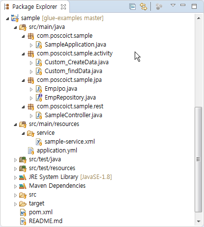
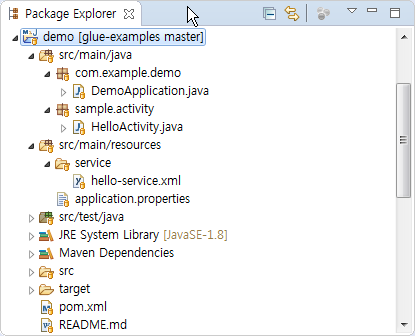

# Example

예제는 [GitHub](https://github.com/poscoict-glueframework/glue-examples)의 
***glue-maven-project*** 와 ***quick-start*** 를 참고하세요.
```bash
$ # workspace 로 이동 : Glue개발환경 참고
$ cd /c/workspace
$ 
$ # 예제소스(glue-examples) 확보
$ git clone https://github.com/poscoict-glueframework/glue-examples.git
$ 
$ ls glue-examples -l    # glue-maven-project, quick-start 확인
``` 
> pom.xml 의  artifactId 값을 확인해보세요.  
> Eclipse의 import 하면,  artifactId가 프로젝트 이름으로 사용됩니다.  
> 프로젝트 이름(artifactId)이 중복되면 import 되지 않을 수 있습니다.  

## glue-maven-project 예제

glue-maven-project는 GlueSDK를 통해서 생성된 프로젝트입니다([참고](https://poscoict-glueframework.github.io/5.1/docs/create-project.html))

Eclipse에서 ***glue-maven-project*** 를 import 하면 다음과 같습니다.


또는 복사후 import 해도 됩니다. 
```bash
$ ls /c/workspace                                 # glue-examples 를 clone함
$ cp -r glue-examples/glue-maven-project/ sample  # sample 로 복사
$ 
$ # sample/pom.xml 의 artifactId 값을 수정한 후 import할 것.
```

## quick-start 예제

quick-start 는 Spring Initializr로 생성한 프로젝트에 glue-core를 추가한 프로젝트입니다([참고](https://poscoict-glueframework.github.io/5.1/docs/quick-start.html)). 

Eclipse에서 ***quick-start*** 를 import 하면 다음과 같습니다.  


또는 복사후 import 해도 됩니다. 
```bash
$ ls /c/workspace                        # glue-examples 를 clone함
$ cp -r glue-examples/quick-start/ demo  # demo 로 복사
$ 
$ # demo/pom.xml 의 artifactId 값을 수정한 후 import할 것.
```

## Ref. 참고

* [GitHub : glue-examples](https://github.com/poscoict-glueframework/glue-examples)
* [sample : glue-maven-project 만들기](https://poscoict-glueframework.github.io/5.1/docs/create-project.html)
* [demo : quick-start 만들기](https://poscoict-glueframework.github.io/5.1/docs/quick-start.html)