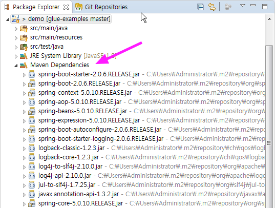

# Spring Boot

Spring Boot은 Spring Framework을 기반으로 하여 빠르게 프로토타이핑해서 운영까지 적용할 수 있는 개발플랫폼입니다. 
그래서 Spring Boot을 통해 단독실행 가능한 스프링 어플리케이션을 생성할 수 있습니다. 
Spring Boot은 Starter를 통해 간결한 의존성 구성 및 Spring에 대한 Auto-Configuration을 제공하고,
개발/운영과 관련된 다양한 기능들 때문에 다양한 분야에서 사용되고 있습니다.

## <a name="starter"></a>Starter

Spring Boot는 다양한 Starter를 제공합니다. 

* [spring-boot-starter](../quick-start.html)
* spring-boot-starter-activemq 
* spring-boot-starter-cache
* [spring-boot-starter-data-jpa](./dev/jpa.html)
* spring-boot-starter-data-rest
* spring-boot-starter-jdbc
* spring-boot-starter-json
* spring-boot-starter-test
* spring-boot-starter-security
* [spring-boot-starter-web](./dev/rest.html)
* spring-boot-starter-websocket
* spring-boot-starter-actuator

## <a name="maven"></a>Spring Boot Build Systems

Spring Boot 의 Build System은 Maven과 Gradle을 제공합니다. 여기서는 Maven만을 다룹니다.

Spring Boot을 사용하려면 다음 2가지 중 하나가 pom.xml에 있으면 됩니다. 
[버전](./glue.html) 기준을 참고해서 parent나 dependencyManagement 버전을 지정하면 됩니다.   

* `spring-boot-starter-parent` : parent를 상속받는 방법으로,
[https://start.spring.io/](https://start.spring.io/)에서 생성된 프로젝트 유형에서 확인 가능합니다. 
    ```xml
    <!-- Inherit defaults from Spring Boot -->
    <project>
        <parent>
            <groupId>org.springframework.boot</groupId>
            <artifactId>spring-boot-starter-parent</artifactId>
            <version>2.0.6.RELEASE</version>
        </parent>    
    </project>
    ```

* `spring-boot-dependencies` : dependencyManagent를 사용하는 방법으로, 
[Glue Maven Project](./create-project.html#glue_maven_project) 로 생성된 프로젝트 유형에서 확인 가능합니다. 
    ```xml
    <project>
        <dependencyManagement>
            <dependencies>
                <dependency>
                    <groupId>org.springframework.boot</groupId>
                    <artifactId>spring-boot-dependencies</artifactId>
                    <version>2.0.6.RELEASE</version>
                    <type>pom</type>
                    <scope>import</scope>
                </dependency>
            </dependencies>
        </dependencyManagement>
    </project>
    ```

Eclipse에서 해당 Project의 Maven Dependencies에서 확인하면 됩니다.


## <a name="maven-plugin"></a>Spring Boot Maven Plugin

Spring Boot 프로젝트를 excutable jar로 패키징하기 위해서는 `spring-boot-maven-plugin`이 필요합니다. 
pom.xml의 plugins에 해당 plugin이 포함되어 있습니다. 

```xml
<project>
    <build>
        <plugins>
            <plugin>
                <groupId>org.springframework.boot</groupId>
                <artifactId>spring-boot-maven-plugin</artifactId>
            </plugin>
        </plugins>
    </build>
</project>
```

자세한 사항은 [spring-boot-maven-plugin](https://docs.spring.io/spring-boot/docs/2.0.6.RELEASE/maven-plugin/)에서 확인할 수 있습니다.

## 실행하기


## 참고 

* [https://spring.io/projects/spring-boot](https://spring.io/projects/spring-boot)
* [https://start.spring.io/](https://start.spring.io/)
* [https://docs.spring.io/spring-boot/docs/2.0.6.RELEASE/api/](https://docs.spring.io/spring-boot/docs/2.0.6.RELEASE/api/)
* [https://docs.spring.io/spring-boot/docs/2.0.6.RELEASE/reference/html/](https://docs.spring.io/spring-boot/docs/2.0.6.RELEASE/reference/html/)
* [https://docs.spring.io/spring-boot/docs/2.0.6.RELEASE/reference/htmlsingle/](https://docs.spring.io/spring-boot/docs/2.0.6.RELEASE/reference/htmlsingle/)
* [https://docs.spring.io/spring-boot/docs/2.0.6.RELEASE/maven-plugin/](https://docs.spring.io/spring-boot/docs/2.0.6.RELEASE/maven-plugin/)