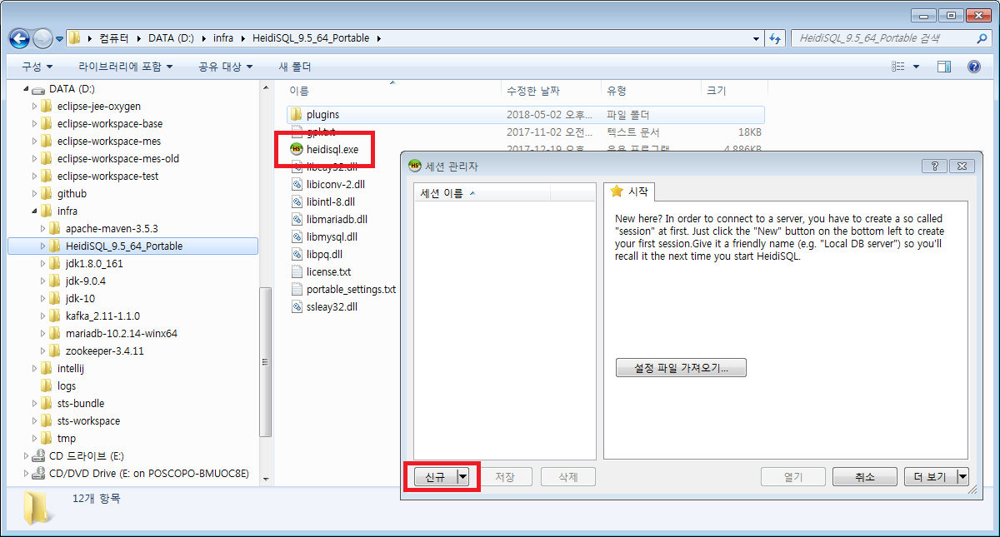
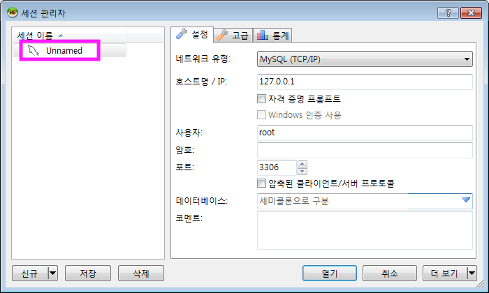

# HeidiSQL

HeidiSQL는 MariaDB, MySQL, MicrosoftSQL, PostgreSQL 라는 Database에 연결해서 data를 조회하거나 수정할 수 있는 프리 소프트웨어입니다.
HeidiSQL은 윈도우에서만 동작하므로, Mac 또는 Linux 사용자는 DBeaver 와 같은 툴을 사용하세요.

## 설치

1. [HeidiSQL](https://www.heidisql.com/download.php) 의 다운로드 페이지에서 툴을 다운받아서 설치합니다( ex. Portable version의 zip 파일 ).  

1. HeideSQL을 실행합니다. 

1. 세션(DB 연결정보) 를 생성합니다. 

## Ref. 참고

* [https://www.heidisql.com](https://www.heidisql.com)
* [https://dbeaver.io](https://dbeaver.io/)