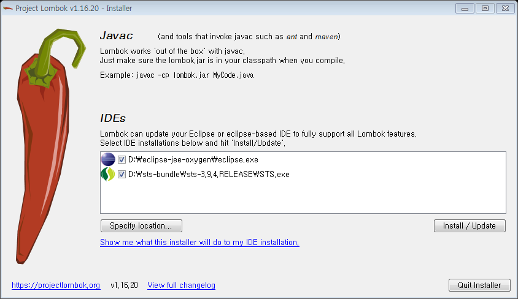
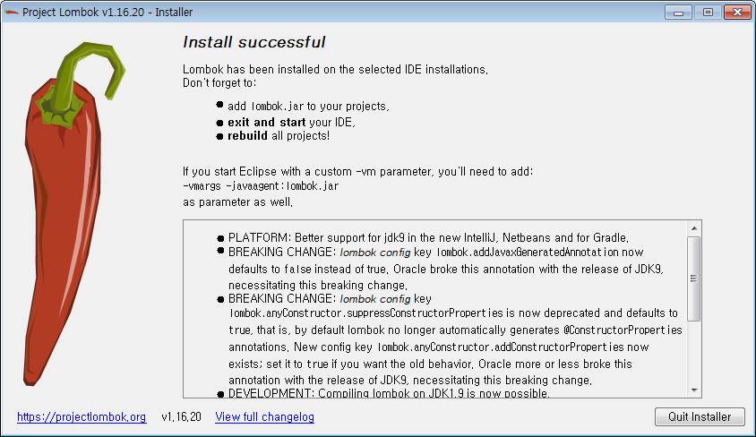

# Lombok

lombok을 사용하면, 클래스에서 필수적으도로 작성해야하는 getter, setter, toString, 생성자 등을 작성하지 않아도 되므로 
코드를 간결하게 사용할 수 있습니다. 

lombok을 사용하기 위해서는 lombok을 설치해야합니다. 

## lombok 설치하기

설치과정은 다음과 같습니다. 

1. lombok 확보하기(download)   
[Project Lombok](https://projectlombok.org) 사이트에서 최신버전의 lombok을 
[다운로드](https://projectlombok.org/downloads/lombok.jar)할 수 있습니다.    
*`C:\ide\eclipse`*에 다운로드 합니다( [개발환경](../docs/env.html#env) 참고 ).

1. lombok 설치하기(`java -jar lombok.jar`)  
다음과 같이 Installer에 보이는 IDE를 선택하고 설치를 진행합니다.  
  
 

1. IDE 재시작하기

> Eclipse의 경우, eclipse.ini 파일에 다음과 같은 라인이 추가되어 있음을 확인할 수 있습니다.
> ```
> -javaagent:C:\ide\eclipse\lombok.jar 
> ```

## lombok 적용하기

java 프로젝트에 lombok 적용과정은 다음과 같습니다. 

1. spring boot project 생성하기

1. lombok dependency 추가하기
    ```xml
    <project>
        <dependencies>
            <dependency>
                <groupId>org.projectlombok</groupId>
                <artifactId>lombok</artifactId>
            </dependency>
        </dependencies>
    ```
1. java code에 lombock annotation 사용하기  
   다음은 User에 @Getter, @Setter를 적용한 예시입니다. 
    ```java
    public class UserTest{
        @Test
        public void userGetterSetter(){
            User user = new User();
            user.setFirstName("poscoict");
            System.out.println(user.getFirstName());
        }
     
        @Getter
        @Setter
        class User {
            private String firstName;
        }
    }    
    ```

## Ref. 참고

* [https://projectlombok.org/](https://projectlombok.org/)