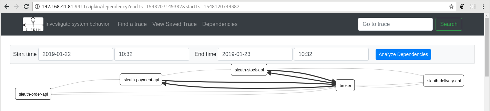
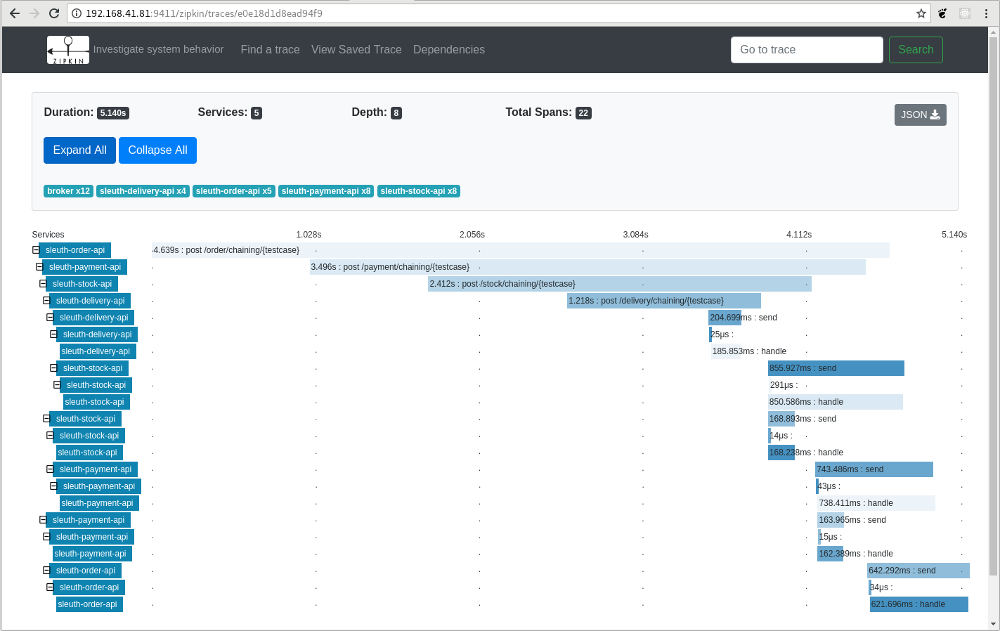

# Zipkin

[Zipkin](https://zipkin.io/) 은 분산 트레이싱 시스템입니다. 
마이크로서비스 분산 환경 모니터링을 위해서, Spring Cloud Sleuth와 Zipkin을 연동하여 
분산환경에서의 이벤트 로그를 모니터링할 수 있습니다.

Zipkin의 [Quickstart](https://zipkin.io/pages/quickstart)에는 Zipkin을 시작하는 3가지 방법이 소개되어 있습니다.
여기서는 Java로 실행하는 것을 다룹니다.  

## 설치 

latest release 를 다운로드합니다(ex. zipkin-server-2.12.0-exec.jar). 

```bash
$ cd /c/infra/                              # 다운로드 정위치는 C:\infra 라고 정  
$ java -jar zipkin-server-2.12.0-exec.jar   # http://localhost:9411
```

## 실행 예시

* Zipkin 서버 실행로그
* 마이크로서비스 ( sleuth-order-api, sleuth-payment-api, sleuth-stock-api, sleuth-delivery-api ) 
* Zipkin Trace 


다음은 Zipkin 서버 실행로그입니다.

```bash
jinia@jin:~$ java -jar ~/Desktop/zipkin-server-2.12.0-exec.jar  # ubuntu 실행예
                                    ********
                                  **        **
                                 *            *
                                **            **
                                **            **
                                 **          **
                                  **        **
                                    ********시
                                      ****
                                      ****
        ****                          ****
     ******                           ****                                 ***
  ****************************************************************************
    *******                           ****                                 ***
        ****                          ****
                                       **
                                       **


             *****      **     *****     ** **       **     **   **
               **       **     **  *     ***         **     **** **
              **        **     *****     ****        **     **  ***
             ******     **     **        **  **      **     **   **

:: Powered by Spring Boot ::         (v2.1.1.RELEASE)

2019-01-22 11:02:53.039  INFO 4559 --- [           main] z.s.ZipkinServer                         : Starting ZipkinServer on jin with PID 4559 (/home/jinia/Desktop/zipkin-server-2.12.0-exec.jar started by jinia in /home/jinia)
2019-01-22 11:02:53.044  INFO 4559 --- [           main] z.s.ZipkinServer                         : The following profiles are active: shared
2019-01-22 11:02:55.178  INFO 4559 --- [           main] i.u.servlet                              : Initializing Spring embedded WebApplicationContext
2019-01-22 11:02:55.179  INFO 4559 --- [           main] o.s.w.c.ContextLoader                    : Root WebApplicationContext: initialization completed in 2073 ms
2019-01-22 11:02:55.699  INFO 4559 --- [           main] o.s.s.c.ThreadPoolTaskExecutor           : Initializing ExecutorService 'applicationTaskExecutor'
2019-01-22 11:02:56.237  INFO 4559 --- [           main] c.d.d.core                               : DataStax Java driver 3.6.0 for Apache Cassandra
2019-01-22 11:02:56.251  INFO 4559 --- [           main] c.d.d.c.GuavaCompatibility               : Detected Guava >= 19 in the classpath, using modern compatibility layer
2019-01-22 11:02:56.525  INFO 4559 --- [           main] c.d.d.c.ClockFactory                     : Using native clock to generate timestamps.
2019-01-22 11:02:56.711  INFO 4559 --- [           main] o.s.b.a.e.w.EndpointLinksResolver        : Exposing 16 endpoint(s) beneath base path '/actuator'
2019-01-22 11:02:56.793  INFO 4559 --- [           main] o.xnio                                   : XNIO version 3.6.5.Final
2019-01-22 11:02:56.805  INFO 4559 --- [           main] o.x.nio                                  : XNIO NIO Implementation Version 3.6.5.Final
2019-01-22 11:02:56.853  INFO 4559 --- [           main] o.j.threads                              : JBoss Threads version 2.3.2.Final
2019-01-22 11:02:56.934  INFO 4559 --- [           main] o.s.b.w.e.u.UndertowServletWebServer     : Undertow started on port(s) 9411 (http) with context path ''
2019-01-22 11:02:56.940  INFO 4559 --- [           main] z.s.ZipkinServer                         : Started ZipkinServer in 4.695 seconds (JVM running for 5.762)
```

다음은 마이크로서비스를 실행한 후에 dependecies를 분석한 모습입니다.

 

다음은 마이크로서비스를 실행한 후에 Trace를 확인한 모습입니다. 

 
